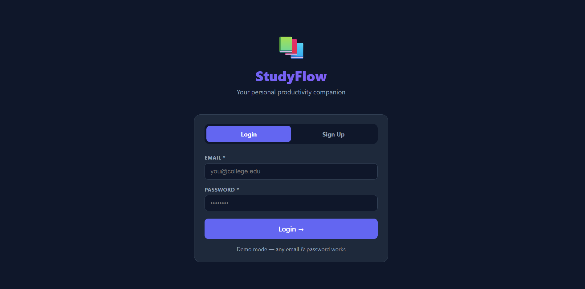
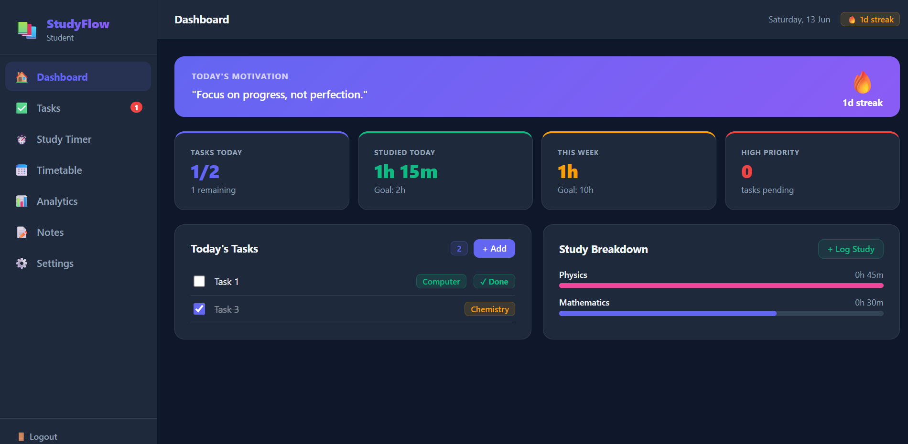
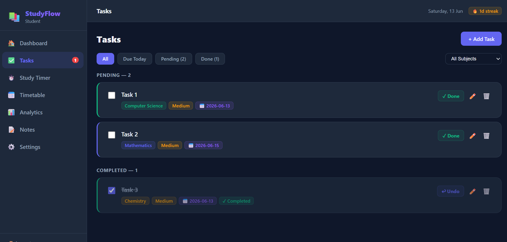
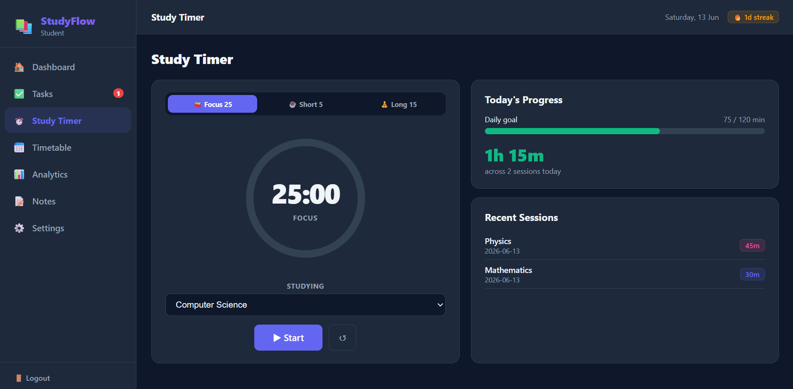
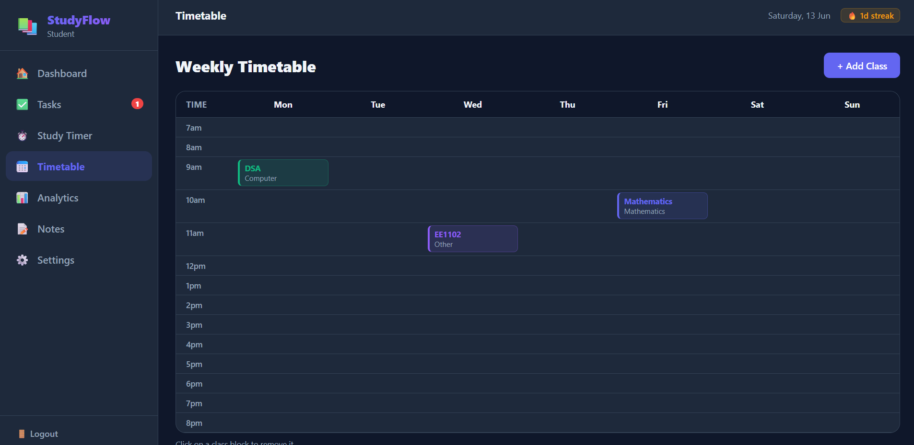
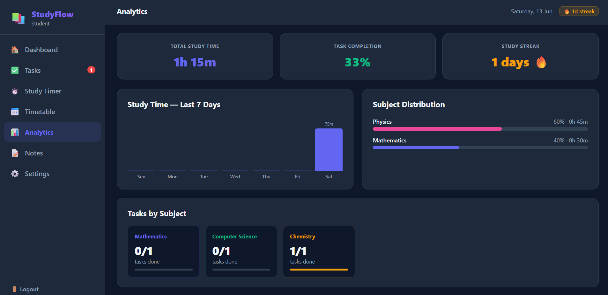

# 📚 StudyFlow

StudyFlow is a modern student productivity web application built using React. It helps students manage tasks, track study sessions, maintain notes, organize timetables, and monitor academic progress through analytics.

## 🚀 Features

### 🏠 Dashboard
- Daily productivity overview
- Motivational quotes
- Task progress tracking
- Study time summaries
- Study streak tracking

### ✅ Task Manager
- Create, edit, and delete tasks
- Set priorities (High, Medium, Low)
- Subject-wise organization
- Mark tasks as completed
- Filter by status and subject

### ⏱️ Pomodoro Study Timer
- 25-minute focus sessions
- Short and long break modes
- Automatic study session logging
- Daily study goal tracking

### 📅 Weekly Timetable
- Create and manage class schedules
- Weekly timetable view
- Subject-based color coding

### 📊 Analytics Dashboard
- Study time tracking
- Subject-wise study distribution
- Task completion statistics
- Weekly productivity insights
- Study streak monitoring

### 📝 Notes Manager
- Create and organize study notes
- Subject categorization
- Search functionality
- Tags support

### ⚙️ Settings
- User profile management
- Daily and weekly study goals
- Dark/Light theme support
- Data export functionality

---

## 🛠️ Tech Stack

- React
- JavaScript (ES6+)
- Vite
- HTML5
- CSS3
- Local Storage

---

## 📂 Project Structure

```text
studyflow/
│
├── public/
│
├── src/
│   ├── App.jsx
│   ├── main.jsx
│
├── index.html
├── package.json
├── vite.config.js
└── README.md
```

## 🎯 Future Improvements

- Firebase Authentication
- Cloud Database (Firestore)
- AI Study Recommendations
- Smart Timetable Generator
- Attendance Tracker
- Exam Planner
- Cross-device Synchronization
- Mobile App Version

---

## 📸 Screenshots










---

## 🤝 Contributing

Contributions, suggestions, and feedback are welcome.

1. Fork the repository
2. Create a feature branch
3. Commit your changes
4. Open a Pull Request

---

## 📄 License

This project is licensed under the MIT License.

---

## 👨‍💻 Author

Shafiya

Electrical Engineering Student | IIT Madras

Built with ❤️ using React.